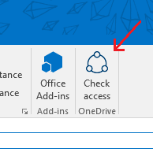

# Microsoft Outlook-Add-In für die Freigabe in OneDrive

Benutzer können jetzt ein Element OneDrive direkt in ein Outlook-add-in freigeben. In diesem Beispiel zeigen wir Ihnen, wie der JavaScript-API für Office und die OneDrive-API verwenden, um ein Microsoft Outlook-Add-in zu erstellen, der angezeigt wird, welche e-Mail-Empfänger, die eine Berechtigung zum Anzeigen des OneDrive-links im Textkörper Nachricht. Wenn Empfänger nicht über die erforderliche Berechtigung zum Anzeigen der Links verfügen, verfügt der Benutzer über die Option zum Gewähren von Berechtigungen für ausgewählte Empfänger.

Mit der OneDrive `shares`-API können Sie programmgesteuert Berechtigungen für ein Element erhalten, indem Sie den Link des Elements verwenden. Anschließend können Sie die gleiche `shares`-API mit `action.invite` verwenden, um die URL für E-Mail-Empfänger freizugeben.


## Inhaltsverzeichnis

* [Anforderungen](#prerequisites)
* [Konfigurieren des Projekts](#configure-the-project)
* [Ausführen des Projekts](#run-the-project)
* [Grundlegendes zum Code](#understand-the-code)
* [Fragen und Kommentare](#questions-and-comments)
* [Zusätzliche Ressourcen](#additional-resources)

## Anforderungen

Für dieses Beispiel ist Folgendes erforderlich:

* Visual Studio 2015 Wenn Sie nicht über Visual Studio 2015 verfügen, können Sie [Visual Studio Community 2015](http://aka.ms/vscommunity2015) kostenlos installieren. 
* [Microsoft Office Developer Tools für Visual Studio 2015](http://aka.ms/officedevtoolsforvs2015)
* [Vorschau der Microsoft Office Developer Tools für Visual Studio 2015](http://www.microsoft.com/en-us/download/details.aspx?id=49972). Beachten Sie, dass sowohl die Basis- als auch die Vorschauversion der Microsoft Office Developer Tools für Visual Studio 2015 installiert werden müssen.
* Outlook 2016
* Ein Computer mit Exchange mit mindestens einem E-Mail-Konto oder einem Office 365-Konto. Sie können sich für ein [Office 365-Entwicklerabonnement](http://aka.ms/ro9c62) registrieren und auf diese Weise ein Office 365-Konto erhalten.
* Ein persönliches OneDrive-Konto. Dies unterscheidet sich von einem Exchange-Konto.
* Internet Explorer 9 oder höher muss installiert, aber nicht der Standardbrowser sein. Zur Unterstützung von Office-Add-Ins verwendet der Office-Client, der als Host agiert, Browserkomponenten, die Bestandteil von Internet Explorer 9 oder höher sind.

Hinweis: Dieses Beispiel funktioniert derzeit nur mit OneDrive-Consumerdienst. 

## Konfigurieren des Projekts

1. Rufen Sie ein Tokens von der OneDrive-Entwicklerwebsite ab. Wechseln Sie zum Abrufen eines Tokens zu [OneDrive-Authentifizierung und Anmeldung](https://dev.onedrive.com/auth/msa_oauth.htm), und klicken Sie auf **Token abrufen**. Kopieren Sie das Token hinter _Authentication: Bearer_, und speichern Sie es in einer Textdatei. Dieses Token ist eine Stunde lang gültig und gewährt Ihnen Lese-/Schreibzugriff auf die OneDrive-Dateien des angemeldeten Benutzers. Sie werden zur Anmeldung bei Ihrem persönlichen OneDrive-Konto aufgefordert.
2. Öffnen Sie die Lösungsdatei **OutlookAddinOneDriveSharing.sln**, und fügen Sie in der Datei `\app\authentication.config.js` das Token wie folgt ein:
```
TOKEN = '<your_token>';
```
3. Klicken Sie im **Projektmappen-Explorer** auf das Projekt **OutlookAddinOneDriveSharing** und ändern Sie im **Eigenschaftenfenster**die Option **Aktion beginnen** zu **Office-Desktop-Client**.

4. Klicken Sie mit der rechten Maustaste auf das Projekt **OutlookAddinOneDriveSharing**, und wählen Sie **Als Startprojekt festlegen**.
5. Schließen Sie den Outlook-Desktopclient.

## Ausführen des Projekts

Drücken Sie **F5**, um das Projekt auszuführen. Sie werden aufgefordert, eine E-Mail-Adresse und ein Kennwort zum Ausführen von Outlook einzugeben. Geben Sie Ihre _Exchange_-E-Mail-Adresse und das Kennwort ein. **Hinweis** Diese weichen möglicherweise von der E-Mail-Adresse und dem Kennwort für Ihr privates OneDrive-Konto ab. 

Sobald der Outlook-Desktopclient gestartet wurde, klicken Sie auf **Neue E-Mail-Nachricht**, um eine neue Nachricht zu erstellen.

**Hinweis** Wenn Sie dazu aufgefordert werden, die Installation für das IIS Express Development Certificate zu bestätigen, navigieren Sie zu **Systemsteuerung** | **Programme**, und wählen Sie **IIS Express**. Klicken Sie mit der rechten Maustaste, und wählen Sie die Option **Reparieren** aus. Starten Sie Visual Studio, und öffnen Sie die Datei „OutlookAddinOneDriveSharing.sln“.

Dieses Add-In verwendet [Add-In-Befehle](https://msdn.microsoft.com/de-de/library/office/mt267547.aspx), sodass Sie das Add-In starten, indem Sie diese Befehlsschaltfläche im Menüband auswählen:



Ein Aufgabenbereich wird mit der Liste der Empfänger angezeigt. In der Liste werden die Empfänger danach sortiert, ob Sie über Berechtigungen zum Anzeigen des Links verfügen. 
**Hinweis** Klicken Sie nach Hinzufügen oder Entfernen von Empfängern oder Änderung des Links erneut auf die Befehlsschaltfläche, um die Liste zu aktualisieren. 

Melden Sie sich zum Abrufen eines OneDrive-Links bei Ihrem OneDrive-Konto unter www.onedrive.com an, und wählen Sie eine Ihrer Dateien. Kopieren Sie den Link für diese Datei, und fügen Sie ihn im Text der E-Mail-Nachricht ein.

## Grundlegendes zum Code

* `app.js` In der Datei „app.js“ wird ein globales Objekt der Empfänger mithilfe von `Office.context.mail.item.getAsync` erstellt, um die Empfänger aus der Nachricht abzurufen. Links werden auf die gleiche Weise mit `Office.context.mail.item.body.getAsync` abgerufen.
* `onedrive.share.service.js` Ein Objekt zum Verarbeiten von Anforderungen für die OneDrive-API. Dieses Objekt enthält:
    - Eine link-Eigenschaft zum Verwalten von Links.
    - Eine Anforderungsmethode zum Senden von Anforderungen an den OneDrive-API-Endpunkt und zum Verwenden der Freigaben- und Berechtigungs-API.
    - Ein UI-Objekt zum Anzeigen des Aufgabenbereichs.
* `render.controller.js` Ein Objekt zum Steuern der Anzeige im Aufgabenbereich. 

## Hinweise

* Das Beispiel überprüft nur den ersten Link im Nachrichtentext.
* Sie müssen ein persönliches OneDrive-Konto zum Abrufen des Tokens verwenden.
* Falls Sie ein Outlook-Konto für das persönliche OneDrive-Konto verwenden und dieses noch nicht zu Office 365 migriert wurde, funktioniert das Freigeben möglicherweise nicht. Um zu überprüfen, ob Ihr E-Mail-Konto migriert wurde, müssen Sie sich bei Outlook.com anmelden. Wenn in der oberen linken Ecke „Outlook.com“ angezeigt wird, wurde das Konto nicht migriert.

## Fragen und Kommentare

Wir schätzen Ihr Feedback hinsichtlich des *Outlook-Add-In-Beispiels für die Freigabe in OneDrive*. Sie können uns Ihr Feedback über den Abschnitt *Probleme* dieses Repositorys senden. Allgemeine Fragen zur Office 365-Entwicklung sollten in [Stack Overflow](http://stackoverflow.com/questions/tagged/Office365+API) gestellt werden. Stellen Sie sicher, dass Ihre Fragen mit [Office365] und [API] markiert sind.

## Zusätzliche Ressourcen

* [Dokumentation zu Office 365-APIs](http://msdn.microsoft.com/office/office365/howto/platform-development-overview)
* [Microsoft Office 365 API-Tools](https://visualstudiogallery.msdn.microsoft.com/a15b85e6-69a7-4fdf-adda-a38066bb5155)
* [Office Dev Center](http://dev.office.com/)
* [Office 365-APIs-Startprojekte und -Codebeispiele](http://msdn.microsoft.com/en-us/office/office365/howto/starter-projects-and-code-samples)
* [OneDrive Developer Center](http://dev.onedrive.com)
* [Outlook Developer Center](http://dev.outlook.com)

## Copyright
Copyright (c) 2016 Microsoft. Alle Rechte vorbehalten.


